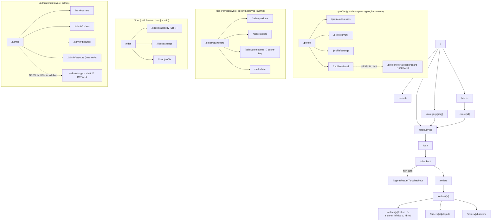

# AUDIT PROFONDO — Marketplace MyCity (Piacenza)
**Data:** 2026-06-23 · **Tipo:** analisi di sistema read-only (codice, funzionalità, collegamenti, bug) · **Metodo:** panel di 11 esperti senior + cartografia di sistema · **Branch:** `claude/upbeat-fermi-26mljy`

> Ogni finding è ancorato a `file:riga` e marcato come **[Fatto]** (verificato nel codice), **[Inferenza]** (dedotto) o **[Ipotesi]** (da verificare a runtime). I markdown storici del repo (`ANALISI_MARKETPLACE.md`, `PROMPT_CLAUDE_CODE.md`, README) sono **datati** e non sono stati usati come verità: tutto è verificato sul codice, sullo schema SQL e sui tipi. Nessun DB live è stato interrogato e nessun runtime eseguito; i claim a runtime sono marcati di conseguenza.

---

## 1. Executive summary

MyCity è un marketplace locale a 4 ruoli (Buyer/Seller/Rider/Admin) **molto più maturo** di quanto i suoi markdown storici suggeriscano: Stripe (Checkout + Connect seller *e* rider + escrow + COD), Supabase con RLS estesa, KYC fail-closed, push, email queue, ~102 migrazioni idempotenti, ~79 test unit. L'ingegneria di base è **solida e visibilmente passata da review iterative**: firma + tripla idempotenza sul webhook Stripe, SSRF guard reale, CSP nonce-based in prod, ownership-check sugli `[id]`, denaro in centesimi/`numeric`, single-source-of-truth per fee/stati/spedizione, **zero link morti** su 112 pagine e **nessuno stub travestito da feature**.

**Ma non è pronto a gestire soldi e dati reali in Italia.** Ci sono cinque blocchi 🔴, di cui due gravissimi e indipendentemente verificati sul codice:

1. **🔴 L'autenticazione delle API è rotta per buyer e rider.** `authenticate()` legge il profilo con la chiave **anon** (non service-role, contrariamente al suo stesso commento): un buyer/rider non è leggibile da `anon` (nessuna policy lo consente, `public_profile_enabled` default `false`) → tutte le route `withAuth*` chiamate da buyer/rider rispondono **403 "Profilo non trovato"**. Verificato il percorso: il checkout COD (`app/checkout/page.tsx:399`) chiama `/api/orders/cod` senza header `Authorization` → 403. **Se confermato a runtime, i buyer non possono ordinare.** Fix da una riga.
2. **🔴 La fatturazione elettronica SDI è promessa ma inesistente.** `lib/invoicing/` non esiste, l'RPC `next_invoice_number` non è mai chiamata, `sdiProvider/sdiApiKey` sono cablati in `lib/env.ts` ma mai usati. La privacy promette il provider SDI e l'UI mostra il link al PDF fattura, ma **nessuna fattura B2B viene mai emessa** — obbligo di legge per i venditori IT.
3. **🔴 Le aree di codice dove nasce e si muove il denaro non hanno test comportamentali**: gli handler del webhook Stripe (creazione ordini multi-seller, refund, dispute, claw-back) e la macchina a stati dell'ordine (codici pickup/delivery anti-frode) hanno copertura ≈ 0.
4. **🔴 La CI dà falsa sicurezza**: non esegue e2e né SQL, e i test RLS si **auto-skippano** senza il secret in CI → la pipeline resta verde anche con RLS completamente rotta.
5. **🔴 (riconciliato a 🟠, vedi sotto)** la moderazione AI dei contenuti esiste ma non è cablata su nessun write-path.

Oltre ai bloccanti: il payout resta **congelato per sempre** dopo un chargeback *vinto* (cron che esclude `dispute_status='WON'`); la commissione 10% grava anche su spedizione e fee di consegna (il netto reale del venditore è inferiore a quello mostrato in UI); rate-limit in-memory non condiviso in multi-istanza; numerazione fattura non a norma; recesso 14gg rifiutabile dal venditore; diritto all'oblio parziale.

**Verdetto:** ottime fondamenta, ma **non andare in produzione con soldi e utenti reali** finché non sono chiusi almeno i 5 🔴 + i 🟠 su pagamenti (chargeback WON, fee base) e compliance (recesso, oblio). Il #1 va verificato **oggi** a runtime: se reale, è un blocco totale del flusso d'acquisto.

---

## 2. Inventario del sistema (numeri reali ricontati)

| Elemento | Conteggio | Note |
|---|---|---|
| Pagine (`app/**/page.tsx`) | **112** | App Router; in larga parte Client Component |
| API route (`app/api/**/route.ts`) | **78** | incl. 9 cron |
| Cron job (`app/api/cron/**`) | **9** | abandoned-carts, expire-checkouts, expire-stale-orders, external-price-alerts, operational-alerts, process-deletions, release-payouts, send-emails, send-push |
| Server Actions (`'use server'`) | **0** | tutte le mutazioni passano da API route o client→Supabase |
| Migrazioni SQL (`migrations/`) | **102** | dichiarate idempotenti |
| Tabelle referenziate dal codice (`.from`) | **~75** | top: profiles (112), orders (88), products (86), categories (37) |
| RPC referenziate (`.rpc`) | **~38** | money/stock/stato per lo più `SECURITY DEFINER` |
| Tipi DB | `lib/database.types.ts` (2405 righe) | drift vs DB non verificabile offline (`db:check-drift` skip, manca `SUPABASE_DB_URL`) |
| Resilienza route | layout **23**, loading **4**, error **5**, not-found **1**, `notFound()` **1** | molto sottile rispetto a 112 pagine |
| Test | ~79 unit · 2 integration security (secret-gated) · 10 e2e smoke · 1 SQL | `verify` = typecheck+lint+test (no integration/e2e) |
| Convenzione `Esperti consultati:` | 46 file | onorata anche da questo audit |

**App esterne (da `.env.example`, wiring in `lib/env.ts`):** Supabase, Stripe, Anthropic/Claude, Resend, Cloudflare Turnstile, SDI (fattureincloud/aruba/mock), KYC (onfido/jumio/veriff/mock), background-removal (removebg/photoroom/mock), Sentry, PostHog, GA4, Web Push/VAPID, Upstash Redis, WhatsApp, Maps/Nominatim, cron-secret. **n8n: dichiarato in sessione ma 0 riferimenti nel codice.**

---

## 3. Le tre mappe (il cuore di questa analisi)

### 3a. Mappa di NAVIGAZIONE (pagina ↔ pagina)

- **Link morti:** **nessuno.** Verifica programmatica di 69 href letterali + ~46 target dinamici/`router`/`redirect` contro le 112 rotte: tutti risolvono. *(Limite: gli href costruiti da dati DB/CMS — `cta_url`, `link_url` — non sono verificabili staticamente.)*
- **Pagine orfane reali:** `/admin/support-chat` (feature chat-supporto funzionante, non in sidebar) · `/profile/referral/leaderboard` (la pagina referral non la linka). Intenzionali: `/store/[id]/[slug]` (canonical SEO), `/shared-cart` (landing da link WhatsApp).
- **Guard per ruolo:** la barriera **server-side reale** è solo `middleware.ts` (JWT + `role` + `is_approved`, ben fatto). I layout di `/seller`,`/rider`,`/admin` duplicano il check **client-side**. `/profile/**` **non** è coperto né dal middleware né dal layout (guard per-pagina, incoerente). → finding 🟠-17/18.
- **Slug dinamici:** 15/16 gestiscono l'id mancante con EmptyState o `notFound()`; **`/orders/[id]/return` no** → spinner infinito (🟠-20).

### 3b. Mappa DATI (codice ↔ database)

Accesso al DB tramite tre client: **utente/anon** (`lib/supabase/client.ts`, RLS attiva), **server-cookie** (`getServerSupabase`, RLS con JWT), **admin/service-role** (`getAdminSupabase`, RLS **bypassata**). Uso del service-role correttamente confinato: webhook, cron, payout/refund, riconciliazione, cancellazione utente.

| Tabella (uso `.from`) | Letta/scritta da | Client | RLS / protezione |
|---|---|---|---|
| `profiles` (112) | quasi tutto; `authenticate()` middleware | ⚠️ **anon** in `authenticate` (BUG 🔴-1); cookie altrove | 5 policy SELECT (owner / seller-approvato pubblico / rider-di-ordine / admin / public_profile). Self-update anti-escalation via trigger 061 ✅ |
| `orders` (88) | checkout, webhook, cron payout, seller/rider/admin | admin (webhook/cron) + cookie | RLS per ruolo; **manca constraint ≥1 item** (🟠-8) |
| `products` / `product_variants` | catalogo, seller, AI, webhook (stock) | cookie + admin | `stock>=0` CHECK ✅; `reserve_stock` atomico ✅ |
| `pending_checkouts` | checkout, webhook, expire-checkouts | admin | unique `(stripe_session_id, seller_id)` ✅ |
| `stripe_event_log` | webhook (idempotenza) | admin | PK `event_id` + `processed` ✅ |
| `email_queue` | cron send-emails | admin (RPC `claim_pending_emails`) | `FOR UPDATE SKIP LOCKED` ✅; fallback non-atomico (🟠-11) |
| `cod_reconciliations` | rider/cash-confirm, admin | admin | unique anti-doppio ✅; finestre temporali disallineate (🟡) |
| `gift_cards` | checkout, redeem | admin (RPC `redeem_gift_card`) | `balance>=0` ✅; manca `balance<=amount` (🟡) |
| `audit_logs` / `activity_events` | lib/audit, track | admin | IP+UA senza retention documentata (🟡); KYC/payout non auditati (🟠-23) |
| `business_orders` | webhook (`invoice_required:true`) | admin | **inserita ma mai consumata** → SDI mai emessa (🔴-2) |

**RPC monetarie/stato** (`reserve_stock`, `restore_stock`, `wallet_credit/debit`, `redeem_gift_card`, `confirm_cod_remittance`, `cancel_order`, `verify_pickup/delivery_code`, `process_expired_deletions`): grant ristretti a `service_role` o auto-guardate con `auth.uid()`/`is_admin()`/ownership+status, `search_path` pinnato sulle recenti. ✅ — da confermare a runtime su DB live: nessuna definer-fn con `proconfig IS NULL` e nessun `EXECUTE` residuo a `PUBLIC` (🟡). `track_sponsored_*` callable da `anon` (solo contatori) → valutare rate-limit (🟡).

### 3c. Mappa INTEGRAZIONI (codice ↔ app esterne)

| Servizio | Punti di chiamata | Env in `env.ts` | Timeout/Retry/Fallback | Mock-in-prod? | Sicurezza |
|---|---|---|---|---|---|
| **Supabase** | ovunque (`lib/supabase/*`) | ✅ | SDK retry | n/a | service-role server-only; `requireSupabaseService()` lancia se assente |
| **Stripe** | `lib/stripe/*`, `app/api/stripe/*` | ✅ | SDK; webhook idempotente | No | ✅ firma + tripla idempotenza |
| **Anthropic/Claude** | `lib/ai/*`, `app/api/ai/*` (19), `app/api/vision/*` | ✅ | ❌ no timeout esplicito; no retry; 503 se non config | No | input in `messages` (no injection); **moderazione NON cablata** (🟠-13); modelli Haiku/Sonnet |
| **Resend** | `lib/email/client.ts`; webhook; cron | ✅ | ❌ no retry; **errori swallowed** (console); skip se no key | n/a | best-effort fire-and-forget; email loggata in chiaro (🟡) |
| **Turnstile** | `lib/captcha.ts` | ✅ | ❌ no timeout; **fail-open** se no secret | n/a | assente su `/api/contact` (🟡) |
| **SDI** | **NESSUNO** (`lib/invoicing/` assente) | ✅ ma **mai letto** | n/a | n/a | 🔴-2: dichiarato, non implementato |
| **KYC** | `lib/kyc/providers.ts`, `app/api/kyc/*` | ✅ | ❌ **no timeout** Onfido/VIES (🟠-14) | ✅ **fail-closed** (ManualReview in prod) | bucket privato + signed URL on-demand ✅ |
| **bg-removal** | `lib/bg-removal/*`, `app/api/image/remove-bg` | ✅ | ❌ no timeout; 503 in prod senza provider | ✅ **fail-closed** | status-only log ✅ |
| **Sentry** | `sentry.*.config.ts`, `lib/analytics/sentry.tsx` | ⚠️ DSN sì; auth-token solo .env.example | inattivo se no DSN | n/a | `beforeSend` minimale (🟡); `setUser` senza email ✅ |
| **PostHog / GA4** | `lib/analytics/*` | ⚠️ PostHog via `process.env` diretto; GA in env.ts | lazy | n/a | ✅ solo dopo consenso (Consent Mode v2) |
| **Web Push/VAPID** | `lib/push/send.ts` | ✅ | no-op se non config; rimuove sub 404/410 | n/a | private key server-only ✅; errori transitori silenziati (🟠-10) |
| **Upstash Redis** | `lib/rate-limit.ts` (process.env diretto) | ⚠️ non in env.ts; **non in render.yaml** | ✅ timeout 500ms + fallback in-memory | n/a | mai fail-open; ma non condiviso senza Upstash (🟠-12) |
| **Maps/Nominatim** | `app/profile/addresses/page.tsx:68`, `app/checkout/page.tsx:386` | URL hardcoded | ❌ no timeout; **chiamato dal browser** | n/a | 🟠-15: viola usage policy (no UA/throttle), no fallback |
| **WhatsApp** | `lib/store-customization.ts` (link `wa.me`) | ✅ | n/a (solo link) | n/a | nessuna API |
| **n8n** | **NESSUNO** | nessuna | n/a | n/a | 🟢 dichiarato ma non cablato |

---

## 4. Scorecard per dimensione

| # | Dimensione | Voto | Motivazione · finding peggiore |
|---|---|---|---|
| 4.1 | Architettura & codice | 🟢 | SSOT per fee/stati/spedizione; confini puliti; 0 Server Actions ma API coerenti. |
| 4.2 | Funzionalità per ruolo | 🟢 | Nessuno stub travestito; feature reali su DB. (varianti prodotto assenti = feature mancante, non finta) |
| 4.3 | Collegamenti tra pagine | 🟢 | Zero link morti su 112 pagine; 2 orfane minori. |
| 4.4 | Collegamenti col DB / RLS | 🟠 | RLS estesa e RPC ristrette, ma `authenticate` legge profiles come anon (🔴-1); manca constraint ordine≥1 item. |
| 4.5 | Collegamenti app esterne | 🟠 | Robustezza fetch incoerente (KYC/VIES/Nominatim senza timeout); moderazione AI non cablata. |
| 4.6 | Pagamenti & denaro | 🟠 | Idempotenza/escrow eccellenti, ma chargeback-WON blocca il payout e la fee grava su spedizione. |
| 4.7 | Sicurezza & AuthZ | 🟠 | Wrapper, IDOR, CSP, SSRF tutti solidi; il difetto è il profile-read anon (🔴-1) e guard di rotta client-side. |
| 4.8 | Affidabilità / cron | 🟢 | 9/9 cron timing-safe + dead-man switch; payout/email idempotenti; gap su send-push e fallback. |
| 4.9 | Performance & scalabilità | 🟡 | Rate-limit non condiviso in multi-istanza; Nominatim dal client; immagini ottimizzate ✅. |
| 4.10 | Frontend & UX | 🟡 | Empty state diffusi e doppio-submit prevenuto, ma error/loading boundary sottili; 1 spinner infinito. |
| 4.11 | Compliance IT/EU | 🔴 | SDI mai emessa (🔴-2); recesso rifiutabile; oblio parziale; numerazione fattura non a norma. |
| 4.12 | Testing & qualità | 🔴 | Webhook/state-machine non testati; CI senza e2e e con RLS auto-skippata (verde con RLS rotta). |
| 4.13 | Observability | 🟡 | Sentry+consent ok; scrubbing client minimale; email in chiaro nei log; logger non strutturato. |
| 4.13b | a11y / i18n / SEO | 🟡 | `zod-i18n` ottimo ma non usato dai form critici; SEO/JSON-LD presenti (da e2e). |

---

## 5. Finding dettagliati (per severità)

### 🔴 CRITICI / BLOCCANTI

#### 🔴-1 [Security] `authenticate()` legge il profilo con la chiave ANON → buyer/rider ricevono 403 su tutte le API
- **Dove:** `lib/api/middleware.ts:66-74` (e `getSupabaseAuthClient()` :30-37). Caller: `app/checkout/page.tsx:399`, `components/rider/CashConfirmDialog.tsx`, `app/api/orders/cod/route.ts:69`.
- **Tipo di collegamento:** codice↔DB (RLS).
- **Cosa:** il commento dice "Fetch profile (sempre via admin per evitare RLS recursion)", ma il codice usa `getSupabaseAuthClient()` = client con **anon key e senza sessione/JWT**. La query `profiles.select('id,role,is_approved').eq('id',user.id).single()` gira quindi con `auth.uid()=NULL`.
- **Perché è un problema:** le 5 policy SELECT su `profiles` (owner / seller-approvato-pubblico / rider-di-ordine / admin / `public_profile_enabled OR auth.uid()=id`, default `false`) **non** consentono ad `anon` di leggere la riga di un buyer/rider ordinario → `.single()` torna vuoto → `forbidden('Profilo non trovato')`. Effetto: **ogni** route `withAuth*` usata da buyer/rider (checkout COD/carta, returns, chat, account, kyc) risponde 403. I seller funzionano solo perché la loro riga è pubblicamente leggibile. È anche la conferma che non esiste leak di `role/is_approved` ad anon.
- **Prova:** `app/checkout/page.tsx:399` `fetch('/api/orders/cod', { headers:{'content-type':'application/json'} })` (nessun `Authorization`) → cookie path → user trovato → profilo letto via anon → 403. Policy in `migrations/001:67`, `006/018`, `011:151`, `012:37`, `033:30`.
- **Epistemico:** [Fatto] su RLS e client anon. [Inferenza] **forte** sul 403 a runtime (percorso deterministico, non eseguito). I test non lo colgono perché mockano interamente `@/lib/api/middleware`.
- **Raccomandazione:** usare `getAdminSupabase()` per la sola lettura del profilo in `authenticate()` (è l'intenzione del commento) **oppure** propagare il JWT/bearer al client così che `auth.uid()=id`. Aggiungere un test d'integrazione che **non** mocka il middleware per un ruolo buyer.
- **Sforzo:** S · **Quick win:** sì · **Verifica oggi a runtime** (priorità assoluta).

#### 🔴-2 [Legal/Integrations] Fatturazione elettronica SDI promessa ma inesistente
- **Dove:** `lib/env.ts:44-46` (provider cablato), `.env.example:50-54`, `app/privacy/page.tsx:107` (promessa), `app/orders/[id]/page.tsx:369` (link al PDF), `app/api/stripe/webhook/route.ts:332-338` (`business_orders` con `invoice_required:true`). RPC `next_invoice_number` in `migrations/024:159-176`.
- **Tipo di collegamento:** codice↔esterno (mancante).
- **Cosa:** `lib/invoicing/` **non esiste**; `sdiProvider/sdiApiKey/fattureincloud/aruba` non sono **mai** usati nel codice; `next_invoice_number` non ha **alcun** caller; `business_orders` viene inserita ma mai consumata; `invoice_pdf_url/invoice_number` non vengono mai popolati.
- **Perché è un problema:** fattura elettronica B2B obbligatoria per i venditori IT. Il cliente che inserisce P.IVA/SDI/PEC e vede il link "scarica fattura" non riceve nulla. Rappresentazione legale senza implementazione.
- **Prova:** `ls lib/invoicing` → assente; `grep -rn "sdiProvider|sdiApiKey|fattureincloud|next_invoice_number" app lib` (escluso env.ts/migration) → 0.
- **Epistemico:** [Fatto].
- **Raccomandazione:** o implementare il provider SDI (FatturaPA/XML, conservazione) **o** rimuovere var/UI/claim fuorvianti finché non è pronto e documentare il processo manuale. Prima della prima emissione, sistemare la numerazione (vedi 🟠-21).
- **Sforzo:** L (implementazione) / S (ritiro claim).

#### 🔴-3 [QA] Nessun test comportamentale sugli handler del webhook Stripe e sulla macchina a stati
- **Dove:** `app/api/stripe/webhook/route.ts:80-139` (~700 righe: creazione ordini multi-seller, split denaro, `charge.refunded` con claw-back+restore stock, dispute won/lost, coupon, gift card). Macchina a stati in funzioni SQL (`cancel_order`, `seller_reject_order`, `verify_pickup_code`, `verify_delivery_code`, migr. 016/061/067). Testati solo signature e idempotenza-wrapper; `tests/unit/order-status.test.ts` copre solo label/icone.
- **Cosa/Perché:** è dove nascono/si invertono ordini e denaro reale, e dove vive l'anti-frode di consegna (codici pickup/delivery). Una regressione corrompe pagamenti/ordini in silenzio.
- **Prova:** nessun test che invochi gli handler `handleCheckoutCompleted`/`handleChargeRefunded`/`handleDisputeClosed` con event simulati; nessun test di transizione di stato.
- **Epistemico:** [Fatto].
- **Raccomandazione:** test su event Stripe simulati (ordini creati, importi, refund/claw-back, dispute won/lost) e su tutte le transizioni di stato ammesse/vietate, inclusi i codici. **Sforzo:** M-L.

#### 🔴-4 [QA] La CI non esegue e2e/SQL e i test RLS si auto-skippano senza secret → verde con RLS rotta
- **Dove:** `.github/workflows/ci.yml` (job lint+build, unit, integration). `tests/integration/security/rls-anon-access.test.ts` e `function-grants.test.ts` usano `describe.skipIf(!hasEnv)`; il job non passa `SUPABASE_SERVICE_ROLE_KEY` → skip silenzioso. `grep playwright ci.yml` → 0.
- **Cosa/Perché:** RLS potrebbe essere rotta e la pipeline resterebbe verde (falsa sicurezza). Gli e2e non girano mai in CI.
- **Epistemico:** [Fatto].
- **Raccomandazione:** fornire i secret di un progetto Supabase di test in CI e far **fallire** (non skippare) se assenti; eseguire Playwright in CI almeno sui flussi critici. **Sforzo:** S (secret) + M (e2e).

#### 🔴-5 → riclassificato 🟠-13 [AI] Moderazione contenuti scritta ma non cablata (vedi sezione 🟠).

### 🟠 ALTI

#### 🟠-6 [Payments] Chargeback VINTO lascia il payout bloccato per sempre
- **Dove:** `app/api/cron/release-payouts/route.ts:54` (`.is('dispute_status', null)`), `app/api/stripe/webhook/route.ts:808` (`update {dispute_status:'WON'}` + notifica "Payout sbloccato").
- **Cosa:** alla chiusura del chargeback vinto si imposta `dispute_status='WON'`, ma il cron seleziona i candidati con `dispute_status IS NULL`. `'WON' ≠ null` → l'ordine non rientra **mai** più tra i candidati (seller, rider, COD).
- **Perché:** il venditore vince la contestazione ma non viene mai pagato; fondi `HELD` a tempo indeterminato. La notifica mente ("Payout sbloccato").
- **Prova:** verificato direttamente: filtro a `route.ts:54`, set a `webhook/route.ts:808`. Il commento `:27` dichiara erroneamente "IS NULL = nessun chargeback aperto".
- **Epistemico:** [Fatto].
- **Raccomandazione:** nel cron `.or('dispute_status.is.null,dispute_status.eq.WON')` (o filtrare solo `OPEN/LOST`), oppure su `won` riportare `dispute_status=null`. Aggiornare l'indice parziale 043. **Sforzo:** S · **Quick win:** sì.

#### 🟠-7 [Payments] La commissione 10% è calcolata anche su spedizione e fee di consegna
- **Dove:** `app/api/stripe/webhook/route.ts:257` e `app/api/orders/cod/route.ts:290` (`computeApplicationFeeCents(g.totalCents)`), vs `lib/products/economics.ts:47` (`commission = prezzo * MARKETPLACE_FEE_RATE`).
- **Cosa:** `g.totalCents = subtotale + spedizione + deliveryFee − sconti`; la fee 10% grava quindi anche su `shipping` (compenso rider) e sul `deliveryFee` (€3 già della piattaforma). L'UI venditore (`economics.ts`) mostra la commissione solo sul prodotto.
- **Perché:** il netto reale del venditore è **inferiore** a quello promesso in UI; la base imponibile della fee diverge tra due fonti. (L'invariante algebrica `payout+fee+deliveryFee+shipping=total` regge: è la *base* a essere incoerente.)
- **Epistemico:** [Inferenza] (divergenza certa; intenzione di prodotto no).
- **Raccomandazione:** calcolare la fee sul solo subtotale prodotti (`computeApplicationFeeCents(subtotalCents)`), allineando webhook + COD a `economics.ts`. **Sforzo:** M.

#### 🟠-8 [Database] Nessun vincolo impedisce un ordine con zero item
- **Dove:** `migrations/001:27-43`. Presente solo `total_price >= 0` (ammette 0).
- **Perché:** ordini vuoti/zero corrompono la matematica di payout/refund.
- **Prova:** grep su `items_count|has_items|at least one item` → 0.
- **Raccomandazione:** trigger deferred o enforcement nell'RPC di creazione (≥1 item); valutare `total_price>0` per ordini pagati. **Sforzo:** M.

#### 🟠-9 [SRE] Email best-effort: errori swallowed, nessun retry per le email critiche
- **Dove:** `lib/email/client.ts:36-65`; callsite webhook `383,395,475,481,716` (fire-and-forget).
- **Perché:** se Resend è giù/rate-limita, la conferma ordine/gift-card è persa silenziosamente; il webhook risponde 200 e Stripe non ritenta per l'email.
- **Raccomandazione:** usare la coda email persistente (`email_queue` + cron `send-emails`, già idempotente) come canale primario per le email post-ordine. **Sforzo:** M.

#### 🟠-10 [SRE] `send-push` marca `pushed_at` anche su fallimento transitorio → notifica persa, errori silenziati
- **Dove:** `app/api/cron/send-push/route.ts:46-52`; `lib/push/send.ts:44-58` (catch ingoia non-404/410).
- **Raccomandazione:** marcare `pushed_at` solo con ≥1 consegna; distinguere transitorio (retry) da permanente; loggare in Sentry. **Sforzo:** S.

#### 🟠-11 [SRE] `send-emails`: il path di fallback non è idempotente
- **Dove:** `app/api/cron/send-emails/route.ts:78-90` (se `claim_pending_emails` fallisce, SELECT senza lock → `processBatch`).
- **Raccomandazione:** in fallback ritornare 503 e ritentare, invece di processare senza claim atomico. **Sforzo:** S · **Quick win:** sì.

#### 🟠-12 [SRE/Perf] Rate-limit in-memory non condiviso in multi-istanza; Upstash assente da `render.yaml`
- **Dove:** `lib/rate-limit.ts:22,96-123`; `render.yaml` non definisce `UPSTASH_REDIS_REST_URL/TOKEN`.
- **Perché:** con scale-out (piano standard) ogni istanza ha bucket separati → limite effettivo N×max, bypassabile. Fallback corretto (mai fail-open) su singola istanza.
- **Raccomandazione:** aggiungere `UPSTASH_*` a `render.yaml` prima dello scale-out. **Sforzo:** S · **Quick win:** sì.

#### 🟠-13 [AI] Moderazione Trust & Safety scritta ma non cablata su nessun write-path
- **Dove:** `lib/ai/moderation.ts` (`assertSafeText`, `classifyProductPolicy`) — header "Da cablare nelle route". `grep` su `app/api/**` → 0 import. `catalog-create`, `catalog-create-bulk`, `catalog-apply`, `catalog-batch/apply` inseriscono prodotti senza gate.
- **Perché:** contenuti vietati (armi, droga, contraffazione, adulto, odio) possono essere pubblicati. `vision/extract-products` fa solo self-report `policy_ok` non vincolante. Mitigante: moderazione admin post-hoc + KYC seller.
- **Raccomandazione:** cablare `classifyProductPolicy` come blocco prima di insert/update su tutti i write-path; non fidarsi del self-report. **Sforzo:** M.

#### 🟠-14 [Integrations] Onfido KYC e VIES senza timeout sulle fetch
- **Dove:** `lib/kyc/providers.ts:41-76,100-106`. Nessun `AbortSignal`.
- **Perché:** un hang upstream blocca la request; col rate-limit "5/ora" pochi hang esauriscono i worker. Incoerente con `ssrf-guard`/`rate-limit` che hanno timeout.
- **Raccomandazione:** `signal: AbortSignal.timeout(...)` su tutte le fetch KYC/VIES + gestione 429/5xx. **Sforzo:** S · **Quick win:** sì.

#### 🟠-15 [Integrations] Nominatim geocoding chiamato dal browser, senza User-Agent né throttle né fallback
- **Dove:** `app/profile/addresses/page.tsx:68`, `app/checkout/page.tsx:386`.
- **Perché:** viola la Usage Policy Nominatim (richiede UA identificativo, vieta uso pesante); rischio ban; nessun caching/debounce; se fallisce, ordini senza lat/lng (silenzioso).
- **Raccomandazione:** proxy server-side con UA + cache + rate-limit, o provider geocoding dedicato. **Sforzo:** M.

#### 🟠-16 [AI] Costo non capato: web_search su Sonnet pilotabile dall'utente + product JSON non limitato
- **Dove:** web_search in `barcode-lookup/improve-product/product-chat/catalog-chat/diagnose/vision`; `lib/ai/productContext.ts:47` (`JSON.stringify(product)` senza cap).
- **Raccomandazione:** cap di lunghezza sul serializzato; Haiku dove basta; budget/spend cap per-seller (telemetria `estCostEur` già presente in `run.ts:171`). **Sforzo:** M · **Quick win:** cap su `JSON.stringify`.

#### 🟠-17 [Navigation/Security] Guard di ruolo dei route group solo client-side
- **Dove:** `app/{admin,seller,rider}/layout.tsx:1` (`'use client'` + `router.replace`); barriera server solo in `middleware.ts:180-194`.
- **Perché:** il middleware è l'unico punto reale; se il matcher cambia o un path sfugge, la difesa residua (layout client) è bypassabile e il bundle/markup viene comunque scaricato. RLS protegge il dato, ma l'AuthZ di rotta dipende da un solo punto.
- **Raccomandazione:** guard server-side nei layout (Server Component: `getUser()` + check + `redirect()`), o documentare il middleware come SSOT e testarlo e2e per ogni prefix. **Sforzo:** M.

#### 🟠-18 [Navigation] `/profile/**` non protetto da middleware né layout; guard per-pagina incoerente
- **Dove:** `middleware.ts:30-34` (no `/profile`), `app/profile/layout.tsx` (no guard). `profile/addresses:46-47` e `profile/referral:19` ritornano lista vuota senza redirect; altre pagine redirigono a `/sign-in`.
- **Raccomandazione:** centralizzare il guard in `app/profile/layout.tsx` (`/sign-in?returnTo=<path>`). **Sforzo:** S · **Quick win:** sì.

#### 🟠-19 [Frontend] Resilienza sottile: 1 `notFound()`, 5 `error.tsx`, 4 `loading.tsx` su 112 pagine
- **Dove:** nessun `error.tsx` in `app/{admin,seller,rider}/**`; nessun `loading.tsx` su `checkout`/liste.
- **Perché:** un errore di fetch nelle aree operative cade sull'error globale generico, senza fallback contestuale/retry.
- **Raccomandazione:** un `error.tsx` per route group (~10 righe) + `loading.tsx` su checkout/liste. **Sforzo:** M · **Quick win:** sì.

#### 🟠-20 [Frontend] `orders/[id]/return` va in spinner infinito su id inesistente
- **Dove:** `app/orders/[id]/return/page.tsx:34-43,86` (`setOrder(data)` senza null-check; `if(!order) return <LoadingState/>`).
- **Perché:** id inesistente o ordine altrui (RLS) → `order` resta `null` per sempre → dead-end silenzioso su un flusso di reso (diritto del consumatore).
- **Raccomandazione:** distinguere "loading" da "not found" (EmptyState), come in `orders/[id]/page.tsx`. **Sforzo:** S · **Quick win:** sì.

#### 🟠-21 [Legal] Numerazione fattura non a norma (rollover anno sovrascrive il contatore)
- **Dove:** `migrations/024:147` (PK = solo `seller_id`), `:168-173` (reset `last_number=1` e overwrite al cambio anno).
- **Raccomandazione:** PK `(seller_id, year)`, riga immutabile per anno. Da sistemare **prima** della prima emissione. **Sforzo:** M.

#### 🟠-22 [Legal] Recesso 14gg trattato come condizionato (il seller può rifiutare)
- **Dove:** `app/api/returns/create/route.ts:77` (`CHANGED_MIND → REQUESTED`), `returns/[id]/decide/route.ts` (`REJECTED` possibile); `app/terms/page.tsx:153` dichiara "senza motivazione". Finestra saltata se `delivered_at` null (`create:50`).
- **Perché:** il recesso entro 14gg è incondizionato (Cod. Cons. 52-59).
- **Raccomandazione:** auto-accept per `CHANGED_MIND` in finestra; richiedere `delivered_at`. **Sforzo:** M + S.

#### 🟠-23 [Legal] Approvazioni KYC e payout non scritti nell'audit log
- **Dove:** `lib/audit.ts` definisce `kyc.approve/reject` ma `app/api/kyc/start-check/route.ts:111-118` non chiama `writeAudit`; payout/Connect nemmeno.
- **Raccomandazione:** audit su ogni transizione KYC/payout. **Sforzo:** S.

### 🟡 MEDI (sintesi)

- **[Security]** `withInternalAuth` usa `SUPABASE_SERVICE_ROLE_KEY` come shared secret cross-purpose (`middleware.ts:220`) → introdurre `INTERNAL_API_SECRET` dedicato. · **[Security]** `/api/contact` senza CAPTCHA (solo honeypot+rate-limit). · **[Database]** `gift_cards` manca `CHECK(balance_cents<=amount_cents)`. · **[Database]** definer-fn storiche senza `search_path` (gran parte retrofittate in 059/061/063; verificare a runtime `proconfig`/`proacl`). · **[Payments]** `expire-checkouts` non rilascia lo stock delle **varianti** (omette `variant_id`, `route.ts:42-44`). · **[Payments]** refund parziale da Dashboard su charge multi-seller → nessun update/clawback (`webhook:654`). · **[Payments]** riconciliazione COD con assi temporali diversi (`delivered_at` vs `cash_confirmed_at`, `cash-confirm:147,160`). · **[SRE]** `/api/track` senza consent-check server-side. · **[SRE]** `operational-alerts` non vigila backlog `email_queue` né error-rate. · **[SRE]** `logger` non strutturato, senza redaction PII. · **[Observability]** Sentry client `beforeSend` rimuove solo i cookie e `captureError` inoltra `context` arbitrario in `extra` senza redaction (replay masked di default, `sendDefaultPii` già false di default → hardening, non breach). · **[SRE/Privacy]** `lib/email/client.ts:39` logga l'email destinatario in `console` in prod (bypassa logger/Sentry). · **[Legal]** export dati incompleto (mancano `conversations/messages`, `contact_messages`, file KYC). · **[Legal]** oblio parziale (solo `profiles` anonimizzato; free-text PII in reviews/returns/contact e indirizzo su ordini ritenuti non redatti). · **[Legal]** `audit_logs/activity_events` salvano IP+UA senza retention documentata. · **[Legal]** P2B: manca la disclosure dei parametri di ranking (badge+separazione sponsored OK). · **[AI]** `catalog-batch/status` senza rate-limit. · **[AI]** immagini ad Anthropic via `source:{type:'url'}` non SSRF-validate (rischio basso). · **[Integrations]** Turnstile/email fail-open se chiave assente. · **[SRE]** env lette via `process.env` fuori da `lib/env.ts` (drift documentazione). · **[Navigation]** orfane `/admin/support-chat` e `/profile/referral/leaderboard`. · **[Product]** `seller/promotions` cache-key mismatch (`promotionsByUser` vs `promotions`, `page.tsx:73/88`). · **[Frontend]** form critici (checkout, contact) non su RHF+zod (errorMap IT inutilizzato).

### 🟢 MINORI / Note

- **[Payments]** `handleChargeRefunded` legge `charge.refunds.data` senza expand garantito (`webhook:661`) → `stripe_refund_id` può restare null. · **[Payments]** idempotenza event-level non transazionale: crash tra creazione ordini e `pending.status='COMPLETED'` può ri-eseguire `increment_coupon_usage`/email. · **[Database]** `track_sponsored_*` callable da anon (solo contatori) → valutare rate-limit. · **[Integrations]** n8n dichiarato ma non cablato (0 riferimenti). · **[Navigation]** `/store/[id]/[slug]` solo canonical SEO (atteso).

---

## 6. Flussi critici end-to-end

1. **Pagamento buyer carta → payout seller/rider.** Checkout ricalcola tutto server-side (prezzi DB, spedizione su distanza, coupon, sconto ritiro, delivery fee), `reserve_stock` atomico, 1 charge sulla piattaforma con `transfer_group`. Webhook (firma + tripla idempotenza) crea N ordini per seller `HELD`. Dopo `DELIVERED+1h`, `release-payouts` paga seller (claim atomico + idempotencyKey) e rider. **Tiene**, tranne: la fee grava su spedizione+deliveryFee (🟠-7); dopo un chargeback **vinto** il payout resta bloccato (🟠-6). **E a monte** il buyer potrebbe non arrivare al pagamento (🔴-1).
2. **COD.** `orders/cod` ricalcola server-side, `wallet_debit` opzionale, `AWAITING_REMITTANCE`. `rider/cash-confirm` (claim atomico) → `admin/cod-remittance` (`confirm_cod_remittance` → `HELD`) → cron payout. **Tiene** (payout COD su saldo piattaforma corretto), con riconciliazione a finestre disallineate (🟡) — **ma** il rider passa da `withAuth` → potenziale 403 (🔴-1).
3. **Reso → rimborso.** `returns/create` → `returns/[id]/decide(APPROVED, amount)` → `refundOrder` (carta: refund Stripe + reversal della quota netta del seller; COD: `wallet_credit` idempotente). **Logica corretta**, ma: recesso rifiutabile (🟠-22); refund parziale da Dashboard non riconciliato (🟡); pagina reso con spinner infinito su id KO (🟠-20); endpoint non testati (🔴-3); il buyer rischia il 403 (🔴-1).
4. **Onboarding + KYC seller/rider.** KYC **fail-closed** in prod (ManualReview, mai auto-APPROVED) ✅, ma senza timeout sulle fetch (🟠-14) e senza audit (🟠-23).
5. **Cancellazione account (GDPR).** `account/delete` + cooldown 7gg + `process-deletions`/`process_expired_deletions` anonimizzano `profiles` e cancellano `auth.users`. **Parziale**: free-text PII in reviews/returns/contact e indirizzi su ordini ritenuti non redatti (🟡); export incompleto (🟡).

---

## 7. Bug ed errori trovati (riproducibilità)

| # | Bug | Riproduzione | Sev |
|---|---|---|---|
| B1 | Buyer/rider 403 su API | Buyer logga, va a `/checkout`, conferma COD → 403 "Profilo non trovato" | 🔴-1 |
| B2 | Payout congelato post-chargeback vinto | Ordine con `dispute_status='WON'` non rientra mai in `release-payouts` | 🟠-6 |
| B3 | Stock variante non rilasciato | Checkout abbandonato 2h su variante → cron `expire-checkouts` non ripristina (manca `variant_id`) | 🟡 |
| B4 | Spinner infinito | Aprire `/orders/<id-inesistente>/return` → loading permanente | 🟠-20 |
| B5 | Promo non si aggiorna | Seller crea promo → lista non rinfresca senza reload (cache-key mismatch) | 🟡 |
| B6 | Notifica push persa | Push service risponde 500 transitorio → `pushed_at` marcato, mai ritentato, errore silenzioso | 🟠-10 |
| B7 | Doppio invio email | `claim_pending_emails` fallisce + due run sovrapposti → email duplicata (fallback non atomico) | 🟠-11 |
| B8 | Fattura B2B mai emessa | Acquisto con P.IVA → nessuna fattura, link PDF vuoto | 🔴-2 |

---

## 8. Cosa è fatto bene (calibrazione della fiducia)

- **Pagamenti core robusti:** firma webhook (`constructEvent` + raw body), idempotenza a 3 livelli (event/order/checkout), denaro in interi-centesimi, `release-payouts`/refund idempotenti (claim atomico + `idempotencyKey`), reversal della sola quota netta del seller, multi-seller split corretto, Connect per seller *e* rider.
- **Sicurezza di base:** wrapper auth centralizzati, ownership-check sugli `[id]`, **SSRF guard** robusto e usato sul rehost immagini, **CSP nonce-based** in prod (no `unsafe-inline` su script-src), service-role confinato server-side, secret server-only (nessun secret in `NEXT_PUBLIC_` improprio).
- **DB:** RLS estesa, RPC monetarie/stato ristrette e auto-guardate, `reserve_stock` atomico, vincoli sui negativi, anti-escalation su self-update profili.
- **Affidabilità:** 9/9 cron timing-safe + dead-man switch (heartbeat), email queue con claim `FOR UPDATE SKIP LOCKED`, health endpoint che misura davvero il DB.
- **Compliance positiva:** KYC fail-closed in prod, consent **opt-in bloccante** prima del tracking (Consent Mode v2), cooldown cancellazione documentato, audit log su refund/ban/dispute/cancel/moderate.
- **Frontend/Prodotto:** **zero link morti** su 112 pagine, **nessuno stub travestito** (feature realmente persistenti), empty state diffusi, doppio-submit checkout prevenuto, `zod-i18n` ben fatto, seller layout maturo (pending/suspended/rejected).
- **Architettura:** single-source-of-truth per fee/spedizione/stati ordine; confini puliti.

---

## 9. Prioritizzazione & roadmap (per ROI)

**Sprint 0 — bloccanti go-live (giorni):**
1. 🔴-1 profile-read via admin in `authenticate()` + test non-mockato (S, **verificare oggi a runtime**).
2. 🟠-6 fix filtro chargeback WON nel cron (S).
3. 🔴-2 decidere SDI: implementare o ritirare claim/UI (S per il ritiro immediato; L per l'implementazione prima del lancio B2B).
4. 🟠-7 fee sul solo subtotale prodotti (M).
5. 🟠-12 Upstash in `render.yaml` (S) · 🟠-11 fallback send-emails (S) · 🟠-10 retry send-push (S).

**Sprint 1 — affidabilità & compliance (1-2 settimane):**
6. 🔴-3 test webhook + state machine; 🔴-4 CI con e2e + RLS non-skippabile.
7. 🟠-22 recesso incondizionato · 🟠-21 numerazione fattura `(seller_id, year)` · 🟠-23 audit KYC/payout.
8. 🟠-14 timeout KYC/VIES · 🟠-15 proxy Nominatim · 🟠-13 cablare moderazione AI.
9. 🟠-17/18 guard server-side route group + `/profile` · 🟠-19/20 error boundary + fix spinner reso.

**Backlog — robustezza (🟡):** constraint ordine≥1 item, gift_card CHECK, secret interno dedicato, CAPTCHA contact, consent server-side su `/track`, export/oblio completi, retention IP/UA, disclosure ranking P2B, cache-key promo, orfane nav, RHF+zod sui form critici, cap costi AI.

**Quick win (alto impatto, sforzo ≤ S):** 🔴-1, 🟠-6, 🟠-11, 🟠-12, 🟠-14, 🟠-18, 🟠-20, 🟢 stock-variante (`variant_id` nel cron).

---

## 10. Domande aperte / assunzioni (da confermare a runtime — nessun DB live né runtime usati)

1. **🔴-1 a runtime:** confermare che un buyer reale riceva 403 su `/api/orders/cod` (cookie-only) e su `/api/stripe/checkout`. È la verifica più urgente: il percorso di codice è deterministico, ma non è stato eseguito.
2. **RLS/grant su DB live:** `SELECT proname FROM pg_proc WHERE prosecdef AND proconfig IS NULL AND pronamespace='public'::regnamespace;` (definer senza search_path) e assenza di `EXECUTE` a `PUBLIC` su funzioni mutanti (`pg_proc.proacl`).
3. **Drift schema↔tipi:** eseguire `npm run db:check-drift` con `SUPABASE_DB_URL` impostato.
4. **Stripe live:** comportamento reale su `charge.refunded` parziale, `stripe_refund_id` valorizzato, payout verso account Connect non onboardati.
5. **Esposizione bundle** delle pagine protette prima del redirect client (🟠-17): ispezionare il payload RSC di `/admin` da utente buyer con JS disabilitato.
6. **Effetto UI** del cache-key mismatch promo (🟡): confermare con `lib/queries/keys.ts`.
7. **Link dinamici CMS** (`cta_url`, `link_url`): non verificabili staticamente, validare a runtime.

---

*Audit condotto come panel di 11 esperti senior in parallelo (Architect, Security/AppSec, Database, Payments, SRE, Frontend/Navigation, Performance, QA, Product, Legal/Privacy, AI) + cartografia di sistema. I finding 🔴-1, 🔴-2 e 🟠-6 sono stati verificati direttamente sul codice oltre che dagli esperti. Metodo: lettura del codice + grep evidence-based; nessuna modifica applicata (audit read-only).*
